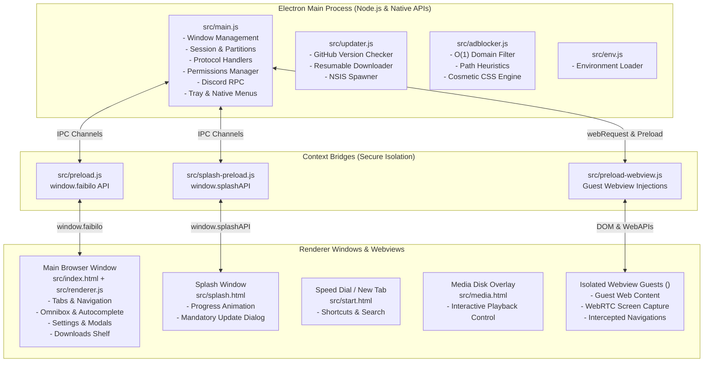
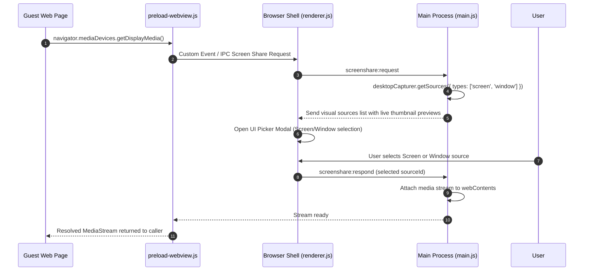

# Faibilo Browser Architecture & System Design 📐

This document provides a comprehensive technical overview of the architecture, process model, security design, memory management, and communication protocols of **Faibilo Browser**.

---

## 1. High-Level Process Architecture

Faibilo is built on Electron's multi-process architecture with strict process isolation, sandboxing, and secure IPC bridges.



---

## 2. Process Separation & Security Model

| Component | Execution Context | Node.js Integration | Context Isolation | Sandbox | Purpose |
| :--- | :--- | :--- | :--- | :--- | :--- |
| **Main Process (`src/main.js`)** | Node.js Runtime | Full Access | N/A | No | Orchestrates OS interactions, window creation, sessions, file system, network interception, and auto-updates. |
| **Main Preload (`src/preload.js`)** | Secure Bridge | Restricted | `true` | `true` | Safely exposes IPC communication channels to `window.faibilo` without leaking Node.js globals. |
| **Renderer (`src/renderer.js`)** | Chromium Renderer | None (Sandbox) | `true` | `true` | Drives the browser UI (tabs, address bar, bookmarks, history, settings, popups). |
| **Guest Webview Preload (`src/preload-webview.js`)** | Webview Context | None | Injected | `true` | Sanitizes guest page events, polyfills notifications, hooks fullscreen, and proxies WebRTC screen share requests. |
| **Splash Preload (`src/splash-preload.js`)** | Secure Bridge | Restricted | `true` | `true` | Relays updater state and boot status to the splash screen. |

---

## 3. Core Subsystems

### 3.1 Session & Partition Management
- **Persistent Profile (`persist:faibilo`)**: Regular browsing tabs share a persistent session stored under `.faibilo-profile/` (in development) or `%APPDATA%\Faibilo` (in production). Cookies, cache, local storage, and site permissions persist across restarts.
- **Ephemeral Incognito Sessions (`incognito:*`)**: Private browsing uses timestamped, in-memory-only partitions. No cookies, browsing history, or permissions are ever written to disk. When all private tabs/windows close, session data is completely purged from RAM.

### 3.2 Tab Hibernation & Memory Optimization
To prevent excessive RAM consumption when dozens of tabs are open:
1. **Inactivity Detection**: Each tab tracks an `idleTimer` (configurable in Settings, default: 30 minutes).
2. **Suspension**: When idle threshold is reached and the tab is not currently active, audio-playing, or pinned, the `<webview>` element is unmounted or parked.
3. **Snapshot Restoration**: The tab keeps its title, favicon, URL, and scroll metadata. Clicking the hibernated tab instantly re-hydrates the webview.
4. **Manual Trimming**: `faibilo.trimMemory()` calls Chromium's garbage collection and working set trimmer on the main process.

### 3.3 Ad, Tracker & Cosmetic Blocker (`src/adblocker.js`)
The blocking engine operates on two complementary layers:
- **Network Level (`electron.session.webRequest.onBeforeRequest`)**: Intercepts requests in $O(1)$ lookup time using high-performance domain sets, subdomain matching, and path pattern heuristics (blocking analytics, telemetry, coinminers, popups, and ad servers).
- **Cosmetic Level (`COSMETIC_AD_BLOCK_CSS`)**: Injected into all pages on `dom-ready` to collapse empty ad placeholders, banner wrappers, sponsored video overlays, and floating popups.

### 3.4 WebRTC Screen Sharing Pipeline


### 3.5 External App Redirection Protection
Malicious websites often attempt to launch desktop clients (Steam, Discord, Spotify, Zoom, Torrent clients) via custom URL schemes (`discord://`, `steam://`, etc.).
- Faibilo intercepts all `will-navigate`, `new-window`, and protocol handlers.
- Non-standard protocols trigger an interactive security prompt asking the user for explicit permission before invoking OS `shell.openExternal()`.
- Users can remember their choice per origin or decline one-time.

---

## 4. IPC Channels Reference

### Window & App Management
| Channel | Type | Direction | Description |
| :--- | :--- | :--- | :--- |
| `window:minimize` | `handle` | Renderer ➔ Main | Minimizes the active browser window. |
| `window:maximize` | `handle` | Renderer ➔ Main | Toggles maximize / restore state. |
| `window:close` | `handle` | Renderer ➔ Main | Closes the active browser window. |
| `window:toggle-fullscreen` | `handle` | Renderer ➔ Main | Enters/exits full screen mode. |
| `app:trim-memory` | `handle` | Renderer ➔ Main | Flushes caches and requests Chromium GC. |
| `app:get-version` | `handle` | Renderer ➔ Main | Returns the current semantic version. |
| `app:is-default-browser` | `handle` | Renderer ➔ Main | Checks if Faibilo is the default Windows browser. |
| `app:set-default-browser` | `handle` | Renderer ➔ Main | Triggers Windows default browser registration. |

### Permissions & Security
| Channel | Type | Direction | Description |
| :--- | :--- | :--- | :--- |
| `permission-requested` | `send` | Main ➔ Renderer | Dispatched when a site asks for camera/mic/geo/notifications. |
| `permission:respond` | `handle` | Renderer ➔ Main | User grants or denies permission request. |
| `permissions:list` | `handle` | Renderer ➔ Main | Returns list of all persisted site permissions. |
| `permissions:forget` | `handle` | Renderer ➔ Main | Removes permission for a specific domain. |
| `app-redirect:request` | `send` | Main ➔ Renderer | Alerts renderer of an external app protocol trigger. |
| `app-redirect:respond` | `handle` | Renderer ➔ Main | Grants or denies launching external app. |

### Updater
| Channel | Type | Direction | Description |
| :--- | :--- | :--- | :--- |
| `app:check-for-updates` | `handle` | Renderer ➔ Main | Fetches and compares remote `version.txt`. |
| `app:install-update` | `handle` | Renderer ➔ Main | Downloads installer file with progress events. |
| `app:update-download-progress` | `send` | Main ➔ Renderer | Emits download percentage and byte counters. |
| `app:install-ready-update` | `handle` | Renderer ➔ Main | Spawns NSIS installer and closes browser. |

---

## 5. Directory Structure & Asset Map

```
faibilo-browser/
├── build/
│   ├── installer.nsh           # NSIS script customizing Windows installation experience
│   └── rotate_tips.ps1         # Real-time tips rotator displayed during NSIS installation
├── docs/
│   ├── ARCHITECTURE.md         # System design, process model, and IPC reference
│   ├── COMPONENTS.md           # Deep-dive file-by-file component breakdown
│   └── FEATURES.md             # In-depth feature documentation
├── scripts/
│   └── start-electron.js       # Spawns local Electron instance with environment flags
├── src/
│   ├── assets/                 # High-resolution logos, application icons (.ico, .png)
│   ├── adblocker.js            # Network and cosmetic ad/tracker blocking engine
│   ├── env.js                  # Zero-dependency .env file parser
│   ├── index.html              # Main browser DOM layout and component templates
│   ├── main.js                 # Electron main process controller
│   ├── media.css / media.html  # Floating media overlay disk player
│   ├── preload.js              # Main renderer secure context bridge
│   ├── preload-webview.js      # Guest webview script injection & API polyfill
│   ├── renderer.js             # Browser UI logic, tab manager, omnibox, settings
│   ├── splash.html             # Startup splash screen & loading UI
│   ├── splash-preload.js       # Splash screen context bridge
│   ├── start.html / start.css  # Speed Dial / New Tab page
│   ├── styles.css              # Main browser styling, dark theme, and animations
│   ├── updater.js              # Update checker, stream downloader, and installer launcher
│   └── widget.html             # Quick speed dial search widget
├── .env.example                # Sample environment configuration template
├── .gitignore                  # Git ignore rules
├── LICENSE                     # MIT License
├── package.json                # Project dependencies, build targets, and metadata
├── README.md                   # Repository overview & quick start guide
├── version.txt                 # Current version release descriptor
└── version.txt.example         # Version metadata guide for GitHub releases
```
