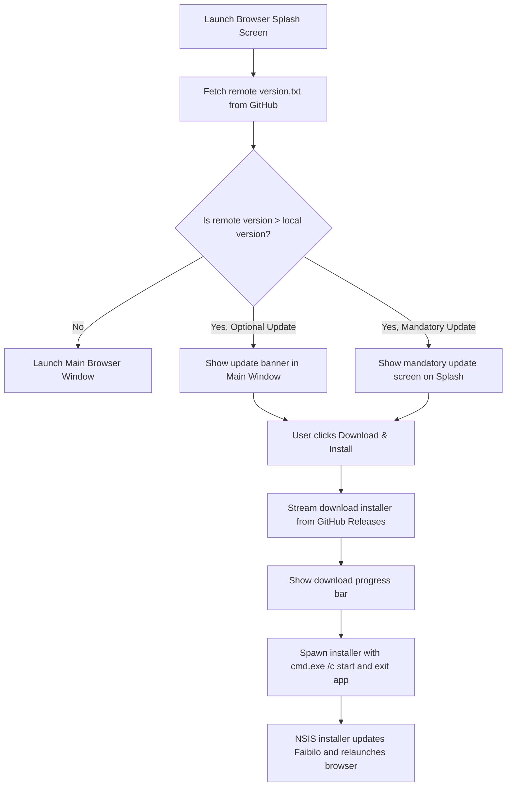

# Faibilo Browser Features & Capabilities 🚀

This document details the core features built into Faibilo Browser, how they work under the hood, and how users and developers can configure them.

---

## 1. 🛡️ High-Performance Ad & Tracker Blocker

### Overview
Faibilo includes a built-in, native ad and privacy blocker designed to maximize page load speeds without requiring third-party extensions.

### How It Works:
1. **Network Interception**: Every outgoing web request made by a `<webview>` is intercepted by `session.defaultSession.webRequest.onBeforeRequest`.
2. **Domain Matching**: Hostnames are checked against an indexed domain hash set (`BLOCKED_DOMAINS` in [`src/adblocker.js`](file:///d:/programing/browser/src/adblocker.js)). If matched, the request is cancelled (`{ cancel: true }`) with zero network overhead.
3. **Path & Substring Heuristics**: Secondary checks catch tracking pixels (`/pixel.gif`, `analytics.js`), coinminers, and telemetry endpoints.
4. **Cosmetic Filtering**: When pages finish loading, [`src/adblocker.js`](file:///d:/programing/browser/src/adblocker.js) injects `COSMETIC_AD_BLOCK_CSS` to hide empty ad slots, video ad wrappers, and sponsored content elements.

---

## 2. 🕵️ Ephemeral Private Browsing (Incognito)

### Overview
Private browsing in Faibilo is designed with an **ephemeral-first** security model.

### Key Characteristics:
- **Isolated In-Memory Partition**: Incognito windows operate within unique `incognito:<timestamp>` session partitions that are never written to disk.
- **Zero Disk Traces**: Cache, cookies, local storage, indexedDB, and download history generated in private mode are stored exclusively in volatile RAM.
- **In-Memory Permissions**: Site permissions granted in incognito mode are kept in an ephemeral array (`incognitoPermissions` in [`src/main.js`](file:///d:/programing/browser/src/main.js)) and immediately vanish when the private window is closed.
- **Session Cleanup**: As soon as all private windows close, the session partition is cleared and garbage collected.

---

## 3. 🖥️ WebRTC Screen Sharing & Device Picker

### Overview
Modern web apps like Google Meet, Discord Web, and Zoom require WebRTC desktop capture. Faibilo provides a secure, interactive screen sharing experience.

### Workflow:
1. The guest web page invokes `navigator.mediaDevices.getDisplayMedia()`.
2. [`src/preload-webview.js`](file:///d:/programing/browser/src/preload-webview.js) catches the request and signals `main.js`.
3. `main.js` calls `desktopCapturer.getSources({ types: ['screen', 'window'], thumbnailSize: { width: 320, height: 180 } })` to capture live previews of all monitors and application windows.
4. An interactive modal dialog opens in `renderer.js`, displaying tabs for **Entire Screen** and **Application Windows** with real-time visual previews.
5. Once the user clicks an item and confirms "Share", the chosen source ID is passed to Chromium's media engine to start streaming.

---

## 4. 🔒 External Application Protocol Interception

### Overview
Prevents malicious or deceptive websites from silently launching desktop software on your machine without your consent.

### Protected Protocols:
- `discord://`, `steam://`, `spotify://`, `zoommtg://`, `slack://`, `tg://` (Telegram), `whatsapp://`, `epicgames://`, `magnet:` (BitTorrent).

### Protection Flow:
1. When a web page attempts to navigate to or open an external protocol, the navigation is paused.
2. A security confirmation dialog appears:
   > *"This website (example.com) is attempting to open Discord on your computer. Do you want to allow this?"*
3. The user can **Allow**, **Deny**, or check **Remember for this site**.

---

## 5. 🎮 Discord Rich Presence (RPC)

### Overview
Displays dynamic status in Discord showing that you are using Faibilo Browser.

### Details:
- Uses `discord-rpc` IPC client connecting to local Discord daemon.
- Displays:
  - Application Name: **Faibilo Browser**
  - Details: E.g., *"Browsing the Web"*, *"Watching a Video"*, *"Listening to Music"*.
  - Tab Counter: Number of open tabs.
  - Elapsed Time: Session duration timer.
- Can be toggled on or off from the browser Settings menu.

---

## 6. 🔄 In-App Auto Updater Architecture

### Overview
Faibilo features a self-contained updater that checks for new releases on GitHub and delivers one-click updates without third-party frameworks.

### Update Workflow:

### Hosting Your Own Updates:
1. Push an updated `version.txt` to your GitHub repo (e.g. `https://raw.githubusercontent.com/saakethban/faibilo-browser/main/version.txt`).
2. Release the new setup executable in GitHub Releases (`Faibilo-Setup-X.X.X.exe`).
3. Set `necessary=true` in `version.txt` if the update is critical/mandatory, or `necessary=false` for optional updates.

---

## 7. 🚀 Tab Hibernation & Memory Management

### Overview
Browsers often suffer from high RAM usage when many tabs remain open. Faibilo solves this with automated tab suspension.

- **Idle Timer**: Inactive tabs are monitored for user interaction.
- **Sleep Engine**: If a background tab is idle for 30 minutes (configurable), the `<webview>` process is safely suspended.
- **Instant Wakeup**: The tab header remains visible with a subtle sleep indicator. Clicking the tab restores the page immediately.
- **Memory Trim**: Settings includes a "Clear Memory" button that triggers `process.trimWorkingSet()` and flushes internal Chromium cache partitions.
